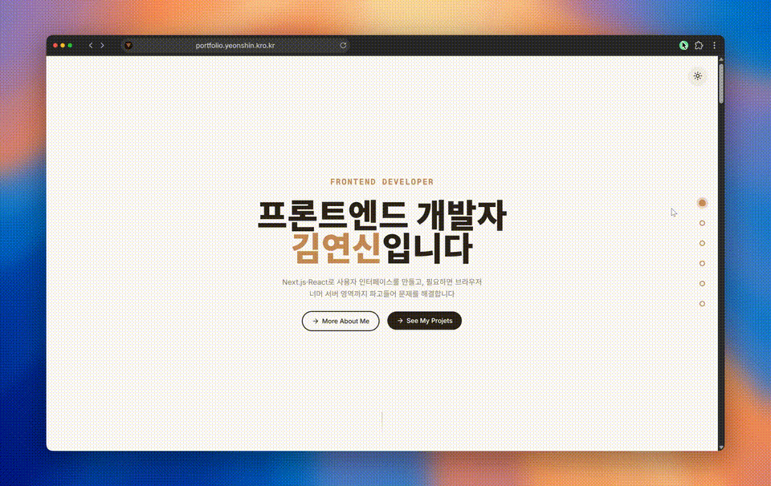
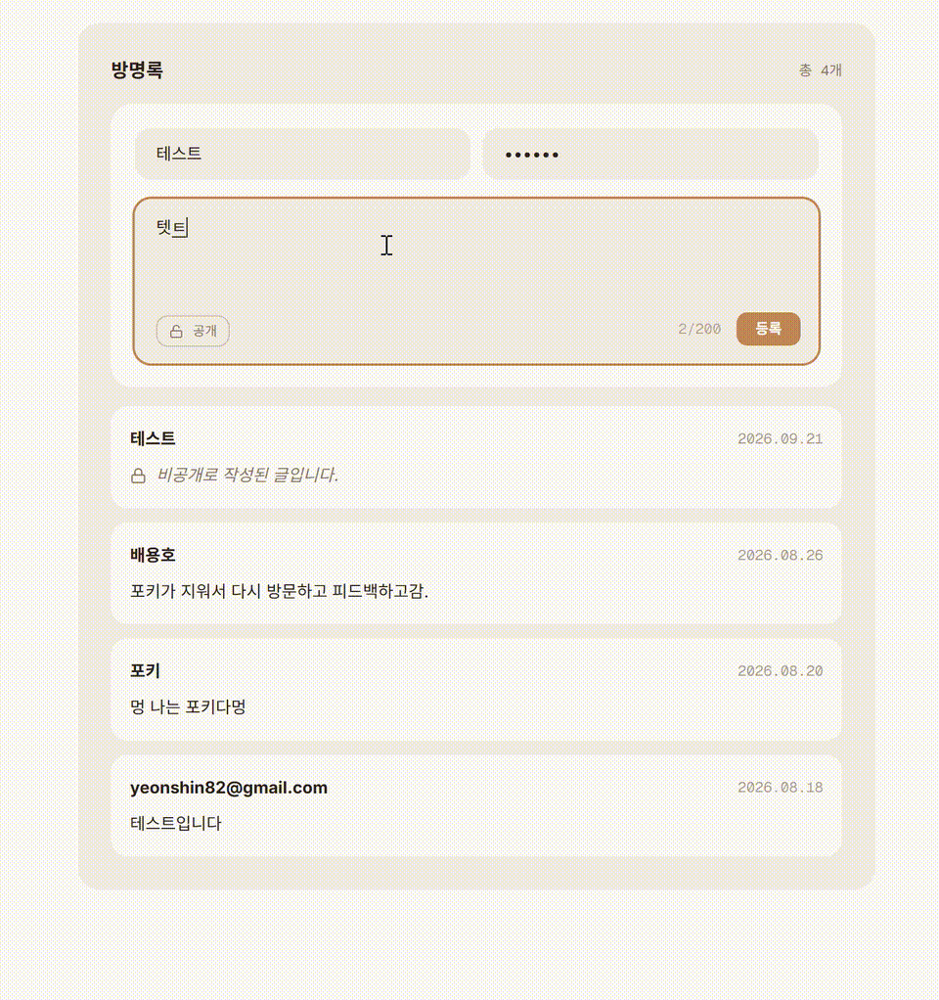
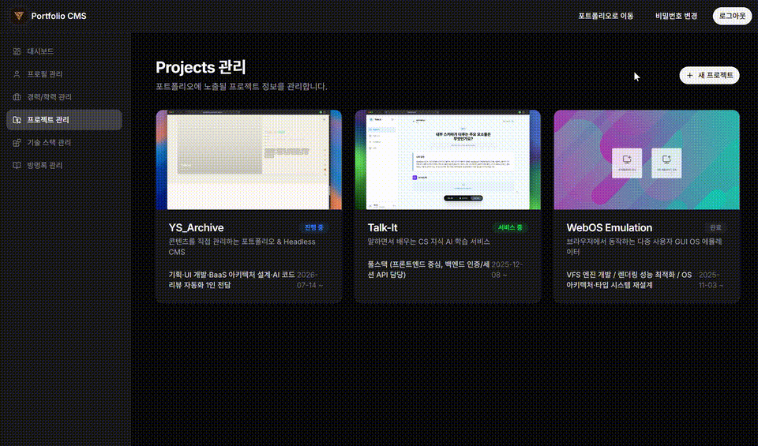
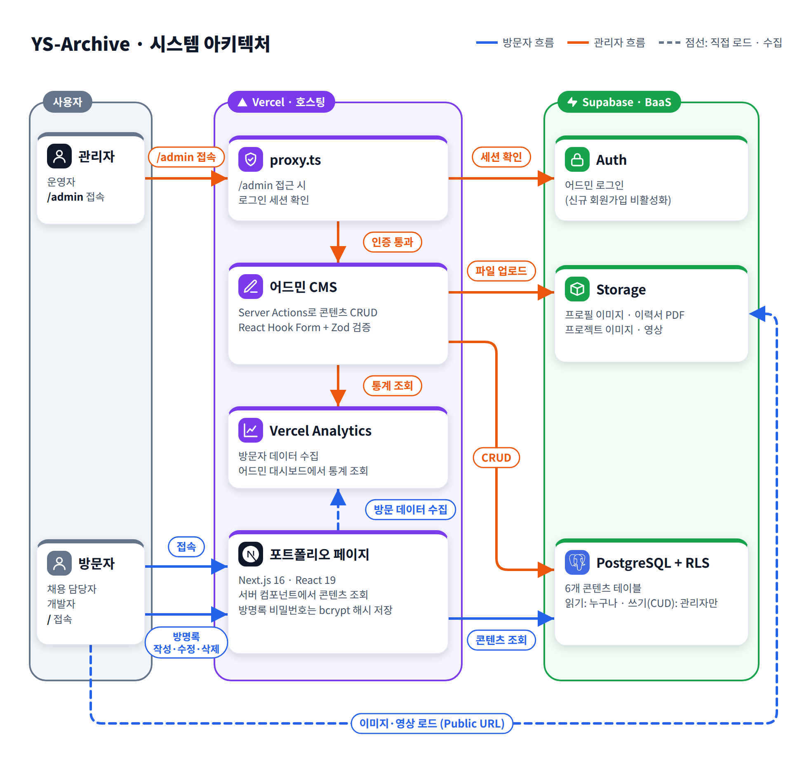

# 📁 YS-Archive - 코드 수정 없이 콘텐츠를 관리하는 Headless CMS 기반 포트폴리오


<br/>

## 🛎️ 서비스 소개

> 서비스 URL: https://portfolio.yeonshin.kro.kr/

- YS-Archive는 프론트엔드 개발자 김연신의 경력·기술 스택·프로젝트를 보여주는 반응형 포트폴리오 웹서비스입니다.
- 모든 콘텐츠는 어드민 CMS에서 직접 등록·수정하며, 코드를 바꾸지 않고도 포트폴리오에 반영됩니다.
- 대상 사용자: 채용 담당자·개발자(방문자), 운영자(관리자)

<br/>

## ❓ 목표

- 프론트엔드부터 Supabase 기반 DB·인증·스토리지, RLS 보안 정책까지 직접 설계해 풀스택 역량을 보여주고, 콘텐츠를 CRUD로 관리하는 Headless CMS 구조로 운영합니다.

<br/>

## ⭐ 주요 기능

### 1️⃣ 프로젝트 카드와 상세 패널


- 지그재그 카드 리스트에서 프로젝트를 훑어보고, '자세히 보기'로 우측 슬라이드 패널을 열어 개요·아키텍처·주요 기능·트러블슈팅을 확인합니다.
- 아키텍처·스크린샷 이미지를 확대해 볼 수 있고, 프로젝트 썸네일 영상은 화면에 가까워질 때 로드되도록 설정했습니다.

### 2️⃣ 경력·학력 타임라인과 기술 스택 필터


- 각종 경험과 학력을 시간순 타임라인으로 확인합니다.
- 기술 스택을 카테고리별로 필터링하면 선택되지 않은 항목이 흐리게 처리됩니다.

### 3️⃣ 방명록



- 회원가입 없이 닉네임과 비밀번호로 최대 200자의 글을 남기고, 비밀번호 확인 후 수정·삭제합니다. (비밀번호는 bcrypt 해시되어 저장됩니다.)
- 비공개 글은 목록에서 마스킹됩니다.

### 4️⃣ 어드민 CMS



- Supabase Auth로 로그인하며, 비인가 사용자의 `/admin` 접근은 `proxy.ts`에서 차단합니다.
- 소개·연락처, 경력·학력, 기술 스택, 프로젝트, 방명록을 CRUD로 관리합니다. (React Hook Form + Zod)
- 프로필 이미지, 이력서 PDF, 프로젝트 이미지·영상을 업로드하면 Supabase Storage의 Public URL로 연결됩니다.

### 5️⃣ 어드민 대시보드


- 방문자 통계 차트와 최근 방명록을 한 화면에서 확인합니다. (Vercel Analytics, Recharts)

<br/>

## 🔧 기술 스택

> **Frontend**

       

> **Backend**


> **Test / Tools**

    

> **Infra**


<br/>

## 🏗️ 시스템 아키텍처



<br/>

## 📁 프로젝트 구조

```
src/
├── app/                 # 라우트 진입점: (portfolio), (admin)/admin
├── components/ui/       # shadcn 공통 UI
├── features/
│   ├── portfolio/       # about, contact, experiences, guestbook, hero, projects
│   └── admin/           # about, auth, dashboard, experiences, guestbook, projects, tech-stacks
├── hooks/               # 공용 훅
├── lib/                 # 유틸, Supabase 클라이언트
├── providers/           # 전역 Provider
├── mocks/               # MSW 핸들러
├── types/
└── proxy.ts             # 어드민 접근 제어
supabase/
└── migrations/          # 스키마, 스토리지, RLS 마이그레이션
```

<br/>

## 🚀 설치 및 실행

### 사전 요구사항

| 도구              | 버전           |
| ----------------- | -------------- |
| Node.js           | 22.x 이상      |
| pnpm              | 10.8.1         |
| Supabase 프로젝트 | 직접 생성 필요 |

### 1. 저장소 clone

```bash
git clone https://github.com/YeonShin/ys-archive.git
cd ys-archive
```

### 2. 환경변수 설정

`.env.example`을 복사해 `.env.local`을 만들고 값을 채웁니다.

```bash
cp .env.example .env.local
```

<details>
  <summary><b>[.env.example]</b></summary>

| 변수                              | 필수 | 설명                                                 | 위치                                    |
| --------------------------------- | :--: | ---------------------------------------------------- | --------------------------------------- |
| `NEXT_PUBLIC_SUPABASE_URL`        |  ✅  | Supabase 프로젝트 URL                                | Project Settings > API > Project URL    |
| `NEXT_PUBLIC_SUPABASE_ANON_KEY`   |  ✅  | 공개용(anon) 키. 접근 제어는 RLS가 담당              | Project Settings > API > anon public    |
| `SUPABASE_SERVICE_ROLE_KEY`       |  ✅  | 서버 전용 관리자 키. RLS를 우회하므로 절대 노출 금지 | Project Settings > API > service_role   |
| `NEXT_PUBLIC_SUPABASE_PROJECT_ID` |  ✅  | 프로젝트 Reference ID                                | Project Settings > General > Project ID |
| `VERCEL_ACCESS_TOKEN`             | 선택 | 대시보드 방문자 통계 조회용 토큰                     | Vercel > Account Settings > Tokens      |
| `VERCEL_PROJECT_ID`               | 선택 | 통계를 조회할 Vercel 프로젝트 ID                     | Vercel > 프로젝트 > Settings > General  |

`VERCEL_*` 두 값을 비워도 앱은 동작하며, 대시보드의 방문자 수만 0으로 표시됩니다. 자세한 설명은 `.env.example`의 주석을 참고하세요.

</details>

### 3. Supabase 준비

스키마·스토리지·RLS 마이그레이션을 원격 프로젝트에 적용하고, 어드민 계정을 만듭니다.

```bash
npx supabase login
npx supabase link --project-ref <YOUR_PROJECT_REF>
npx supabase db push
```

이후 Supabase Dashboard → Authentication → Users에서 어드민 계정을 생성하고, 신규 회원가입(Allow new users to sign up)을 끕니다. 자세한 절차는 [supabase/db_setup_guide.md](supabase/db_setup_guide.md)를 참고하세요.

### 4. 의존성 설치

```bash
pnpm install
```

### 5. 실행

**개발 모드**

```bash
pnpm dev
```

**프로덕션 모드**

```bash
pnpm build
pnpm start
```

### 6. 접속

👉 http://localhost:3000 (포트폴리오), http://localhost:3000/admin/login (어드민)

초기 데이터는 없으므로, 어드민에서 직접 콘텐츠를 등록합니다.

<br/>

## 📖 사용법

1. `/`에 접속해 포트폴리오를 둘러봅니다. (기술 스택 필터, 프로젝트 상세, 방명록)
2. `/admin/login`에서 Supabase에 만든 어드민 계정으로 로그인합니다.
3. 메뉴별로 소개, 경력, 기술 스택, 프로젝트를 등록·수정합니다.
4. 저장한 내용이 포트폴리오 화면에 반영되는지 확인합니다.

<br/>

## ✅ 테스트

```bash
pnpm test            # 테스트 실행
pnpm test:coverage   # 커버리지
```

<br/>

## 📌 문의

| <a href="https://github.com/YeonShin"></a> | **김연신**<br/>Frontend Developer<br/>[@YeonShin](https://github.com/YeonShin) |
| :---------------------------------------------------------------------------------------------------------------------------------: | :----------------------------------------------------------------------------- |
